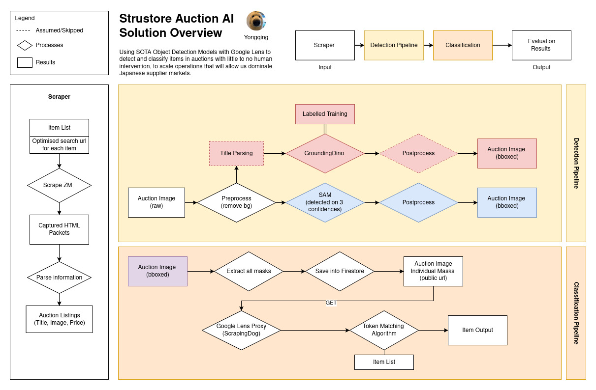

# strustore-auction-ai 
(previously called triple-a)

Author: Yongqing
Date: 28/08/2025

To analyze the images within Yahoo Auctions Japan(yjpa)/Zenmarket(zm) with ML/DL Models, in order to retrieve the given information without human evaluation. We focus on 2 main sections: Detection & Classfication.

Information we would like to obtain includes: item, variation and colour identification.
View all documentations on [Drive](https://drive.google.com/drive/folders/1gji1mAN-M2fN4ATQe0Kd1VZxsYAyL1z6?usp=sharing)

## Solution Overview


In v1, the solution of the whole pipeline remains as such. 

## SAM (Segment Anything)

### Pre-requisites

If there are any dependency errors, refer to the official [Segment Anything](https://github.com/facebookresearch/segment-anything) project.
1. Start a new python venv file `.sam-venv`
2. Enter the venv and register it as a jupyter notebook kernel
```
source .sam-venv/bin/activate
python -m ipykernel install --user --name=.sam-venv --display-name "Python (.sam-venv)"
jupyter kernelspec list #check if the kernel is creater properly
```
3. Install required dependencies in `SAM/requirements.txt`
```
pip install -r ./SAM/requirements.txt
```

### Running SAM Analysis on Jupyter

All files to run SAM are in `./SAM/*` and outputs are in `./zm_scraper/auctions/sam`
- Ensure that the notebook is using the kernel you created
- Preprocessing: `./SAM/bg-remover.ipynb`
- Analyzer: `./SAM/better-pipeline.ipynb`
- Postprocessing: `./SAM/postprocess.ipynb`

## GroundingDINO

### Pre-requisites

1. Follow the instructions on [GroundingDINO's Official Github Repo](https://github.com/IDEA-Research/GroundingDINO) to set CUDA HOME
2. Start a new python venv file `.gdino-venv`
3. Enter the venv and register it as a jupyter notebook kernel
4. Install required dependencies
```
pip install -e .
```

### Running GroundingDINO Analysis on Jupyter

All files to run GroundingDINO are in `./GroundingDINO/*` and outputs are in `./zm_scraper/auctions/gdino`
- Ensure that the notebook is using the kernel you created
- Preprocessing: `./SAM/bg-remover.ipynb`
- Analyzer: `./GroundingDINO/better-pipeline.ipynb`

### Finetuning GroundingDINO

To finetune GroundingDINO, the project [Open GroundingDINO](https://github.com/longzw1997/Open-GroundingDino) is used.
1. Start a new python venv file
2. Enter the venv and register it as a jupyter notebook kernel
3. Install required dependencies mentioned in the Open GroundingDINO official Github repository.

To start training, export the labels in `COCO` format.
1. Split 70/30 for (training/testing) with `./tools/split_train_test_dataset.py`. Training Data is in `ODVG` format and testing in `COCO`
2. Convert the training files to `ODVG` using the script in`./tools/coco2odvg.py`.
```
cd Open-GroundingDino
python ./tools/coco2odvg.py --input ./annotations/default_labels.json --split ./annotations/dataset_split.json --train_output ./annotations/train_odvg.jsonl --test_output ./annotations/test_coco.json
```
3. Train the model
```
bash train_dist.sh 1 ./config/cfg_odvg.py ./config/datasets_odvg.json ./logs
```

## Classification Pipeline (Lens)

1. Start a new python venv file
2. Enter the venv and register it as a jupyter notebook kernel
3. Install required dependencies 

```
pip install -r requirements.txt
```

## Running Jupyter Notebook Locally

1. Start jupyter notebook
```
jupyter notebook
```
2. To view jupyter notebook in your own browser, tunnel the traffic on port 8888 to local machine
```
ssh -i ~/.ssh/gcp-nintendo-eval -L 8888:localhost:8888 user@gcp-ip
```